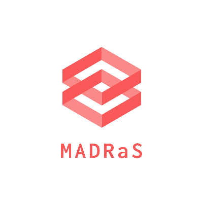

<h3 align="left"></h3>

`Use an env using python 3.7.X`

# Description
MADRaS is a Multi-Agent Autonomous Driving Simulator built on top of TORCS. The simulator can be used to test autonomous vehicle algorithms both heuristic and learning based on an inherently multi agent setting.
# Installation prerequisities 

- Download [torcs-1.3.6](https://sourceforge.net/projects/torcs/files/all-in-one/1.3.6/torcs-1.3.6.tar.bz2/download), [plib-1.8.5](http://plib.sourceforge.net/download.html)

- Install Dependencies
``` shell

sudo apt-get install libalut-dev 
sudo apt-get install libvorbis-dev 
sudo apt-get install libxrandr2 libxrandr-dev 
sudo apt-get install zlib1g-dev 
sudo apt-get install libpng-dev 
sudo apt-get install libplib-dev libplib1 
sudo apt-get install python-tk
sudo apt-get install xautomation
```
- Installling plib (follow instructions on the plib page)
- Installing TORCS
``` shell

tar xvjf torcs-1.3.6.tar.bz2  
cd torcs-1.3.6/
./configure
make
sudo make install
sudo make datainstall

Torcs will give 2 errors while making, the /torcs-1.3.6/src/libs/musicplayer/OpenALMusicPlayer.cpp will have a nullptr error, change '\0' to nullptr. Followed by an isnan error in a file, change it to std::isnan.
```
- test if torcs is running by typing `torcs` in a new terminal window
- Installing the scr-patch
  - Download [scr-patch](https://sourceforge.net/projects/cig/files/SCR%20Championship/Server%20Linux/2.1/scr-linux-patch.tgz/download)
  - unpack the scr at the base of the torcs repo `torcs-1.3.6/..`
 ``` shell
 cd scr-patch
 sh do_patch.sh #whenever prompted choose the default action [n]
 cd ..
 make
 sudo make install
 sudo make datainstall
 ```
 - test if scr client is installed or not.
   - open TORCS, navigate to configure race (race->quickrace->configure race -> select drivers) 
   - check the Not-Selected list for `scr-serverx` where x will range in [1,9]
- Installing the cpp scr client
  - Download [scr-client-cpp](https://sourceforge.net/projects/cig/files/SCR%20Championship/Client%20C%2B%2B/2.0/scr-client-cpp.tgz/download)
  - unpack the scr at the base of the torcs repo `torcs-1.3.6/..`
``` shell
cd scr-client-cpp
make
```
_Tested on ubuntu-16.04_
# Installation MADRaS

``` shell
git clone https://github.com/samkit-2512j/MADRaS_TAO_Project.git
pip3 install -r requirements.txt
```

# Set up TORCS:
Type torcs in a terminal and click on `Quick Race` and `Configure Race`.
Make sure to chose the driver `scr_server1`. Just click on accept after picking the driver.

# Setting TORCS up for DDPG:
run the bash script `startTORCS.sh` in `./scripts/`.
After an episode ends while training, click on new race to begin the training of the next episode.
Add new race mouse location using xdotools in `autostart.sh` to automate clicking on new race.(Get mouse location of new race). Uncomment the last line in the script and change the coordinates.

# Examples
The examples are currently located in the [example_controllers] folder. 
Run the below command in the base MADRaS directory.
```
### PID
```terminal
foo@bar~$ python3 -m example_controllers.pid.playGame_DDPG_pid 3001 #for single agent training
```


The network checkpoints for the PID controller are saved in `MADRaS/save_network_checkpoints/` . To train an agent from scratch clear the same folder.
To test the model, set `is_training` in `/example_controllers/pid/configurations.yml` to 0.
